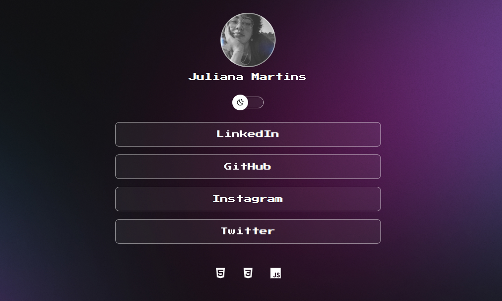

<h2 align="center">DevLinks</h2>
 
<a href="https://ju7iana.github.io/devlinks/" target="_blank">Link do projeto</a>

Projeto promovido pela Rocketseat

 

 
<h3> 🚀 Tecnologias utilizadas:</h3>

<ul>
<li>HTML e CSS</li>
<li>JavaScript</li>
<li>Git e GitHub</li>
<li>Figma</li>
</ul>

